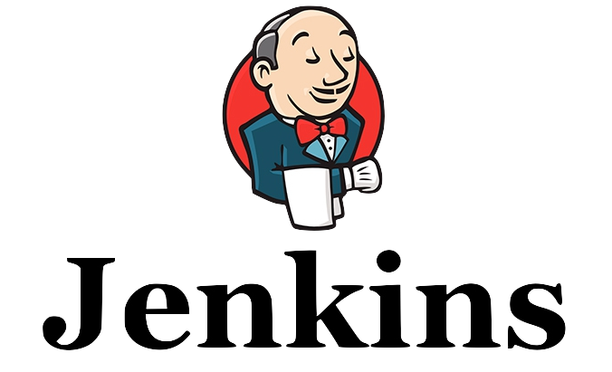

# Challenge:

**Objetivo:** Implementar a solução de CI/CD [Jenkins](https://www.jenkins.io/doc/book/installing/) de acordo com os paterns de arquitetura a seguir:

* A infraestrutura deve ser construída com base no conceito *"infrastructure-as-code"* utilizando um *"cloud provider"* de sua escolha;
* A aplicação e sua respectiva infraestrutura deve ser entregue utilizando uma solução de automação também de sua escolha;
* A aplicação deve contar com persistência de dados;
* A solução inteira deve ser implantada considerando H.A em relação ao acesso à aplicação;
* Os componentes da solução devem ser monitorados;

---

**Entregas**

1. Para o trabalho final a equipe deve construir um desenho de arquitetura do modelo descrito usando a solução [Draw.io](https://www.draw.io/) ou similar;

2. Além do desenho de arquitetura entregar um documento curto respondendo as seguintes questões:

2.1. Qual a solução ou conjunto de soluções de automação utilizada pela equipe e quais as motivações para a escolha com base nas questões discutidas em aula?

2.2. Quais mecanismos foram utilizados para estabelecer o modelo de H.A., considere opções como loadbalancers, mecanismos de quorum e service register como [Consul](https://www.consul.io) ou [Packer](https://www.packer.io) e similares.

2.3. Qual a solução de monitoração escolhida pela equipe e quais as motivações dessa escolha;

2.4. Qual a abordagem para monitorar seu ambiente,  com base no que o grupo entende que seria o cenário ideal para aaliar e garantir a disponibilidade da aplicação;

---
##### Fiap - MBA DEVOPS Engineering
profhelder.pereira@fiap.com.br

**Free Software, Hell Yeah!**
