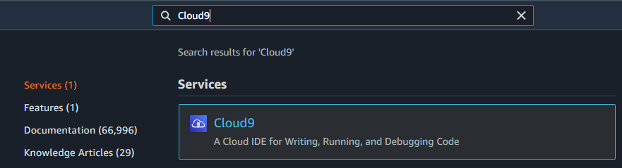
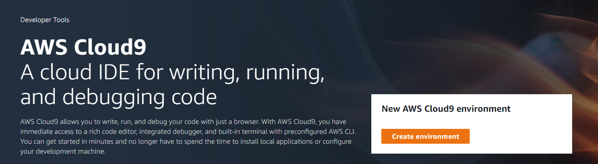
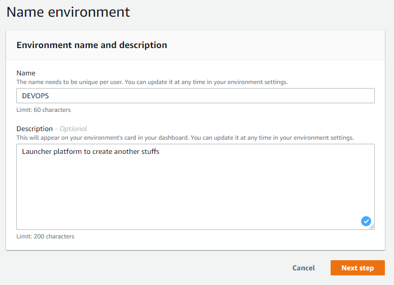
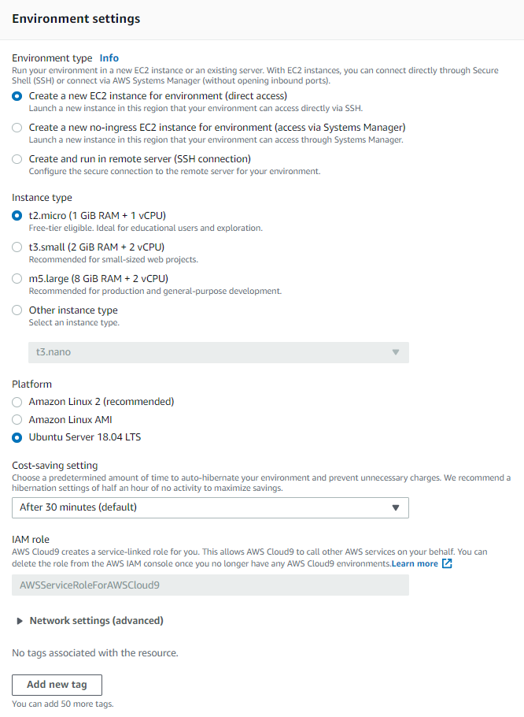

# DEVOPS Enginnering

Nesta configuração você fará a preparação da instância que utilizaremos para os laboratórios envolvendo o ambiente AWS;
## 1. Configurando a instância de trabalho com Cloud9

1.1. Acesse a conta destinada ao laboratório conforme os dados enviados por e-mail, no painel de serviços da AWS, utilize a barra de busca na área superior para localizar e selecionar o serviço Cloud9:



1.2. No menu seguinte escolha a opção **"Create environment"** para começar a configuração da instância que usaremos como ponto de partida para nossos projetos;



1.3. Para o campo **"Name"** faça o preenchimento com **"DEVOPS**, colocar uma description é opcional;



1.4. Preencha o formulário "Configure settings" de criação da instância utilizando os dados abaixo:

| Campo            | Configuração                                                |
|------------------|-------------------------------------------------------------|
| Environment type | Create a new EC2 instance for environment (direct access)   |
| Instance type    | t2.micro (1 GiB RAM + 1 vCPU)  |
| Platform         | Ubuntu Server 18.04 LTS        |

Qualquer campo não mencionado deve ser mantido com o valor atual do template, ao final do processo configura de acordo com o exemplo abaixo e clique em **Next Step**;



Em seguida clique em **"Create environment"**

Durante o processo de configuração a mensagem **"We are creating your AWS Cloud9 environment. This can take a few minutes."** será exibida

*Aguarde até que o ambiente seja configurado, um termninal de administração será aberto para executar os próximos passos;*

---

## 2. Configuração do repositórios e feramentas de trabalho;

Nesta etapa faremos algumas configurações na instância de onde partirá as automações dos laboratórios práticos;

2.1. Após finalizar o processo anterior um terminal será exibido dentro do Cloud9, faça uma cópia do [repositório git do laboratório](https://github.com/fiapdevops/automation) da disciplina;

```sh
git clone https://github.com/fiapdevops/automation
```

2.2. Execute o script de instalção das ferramentas que serão usadas durante os laboratórios:

```sh
sudo bash -x $HOME/environment/automation/cloud9/scripts/config.sh
```

##### Fiap - MBA Cyber Security Forensics, Ethical Hacking & DevSecOps
profhelder.pereira@fiap.com.br

**Free Software, Hell Yeah!**
