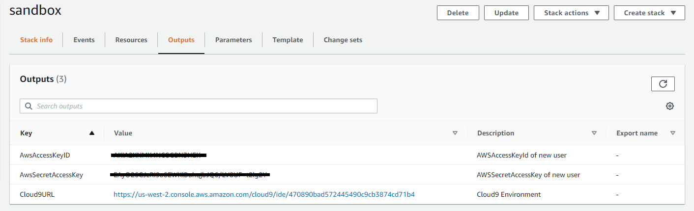

# DEVOPS Enginnering

Nesta configuração você fará a preparação da instância que utilizaremos para os laboratórios envolvendo o ambiente AWS;

## 1. Processo de configuração via automação:

1.1. Para configurar automaticamente faça o login na conta da AWS indicada pelo Professor e acesse o pefil "DeployEnvironment", e em seguida clique no link abaixo para disparar o template de automação:

[](https://console.aws.amazon.com/cloudformation/home?region=us-east-1#/stacks/new?stackName=sandbox&templateURL=https://s3.us-east-1.amazonaws.com/cf-templates-fiaplabs-automation/C9.yaml)


1.2. Verifique as informações de acesso na guia "Outputs" dentro da Stack:



**Não aplique essas credenciais até que seja solicitado nas próximas etapas do laboratório**

---
## 2. Configuração do repositórios e feramentas de trabalho;

Nesta etapa faremos algumas configurações na instância de onde partirá as automações dos laboratórios práticos;

2.1. Após finalizar o processo anterior um terminal será exibido dentro do Cloud9, faça uma cópia do [repositório git do laboratório](https://github.com/fiapdevops/automation) da disciplina;

```sh
cd ~/environment
git clone https://github.com/fiapdevops/automation
```

2.2. Execute o script de instalção das ferramentas que serão usadas durante os laboratórios:

```sh
chmod +x ~/environment/automation/cloud9/scripts/*.sh

~/environment/automation/cloud9/scripts/config.sh
```

2.3. Após a configuração execute o script de criação das chaves de SSH, elas serão necessário para acesso entre o host do cloud9 e as instâncias que criaremos noas laboratórios;

```sh
~/environment/automation/cloud9/scripts/remote.sh
```

---

##### Fiap - MBA Cyber Security Forensics, Ethical Hacking & DevSecOps
profhelder.pereira@fiap.com.br

**Free Software, Hell Yeah!**
