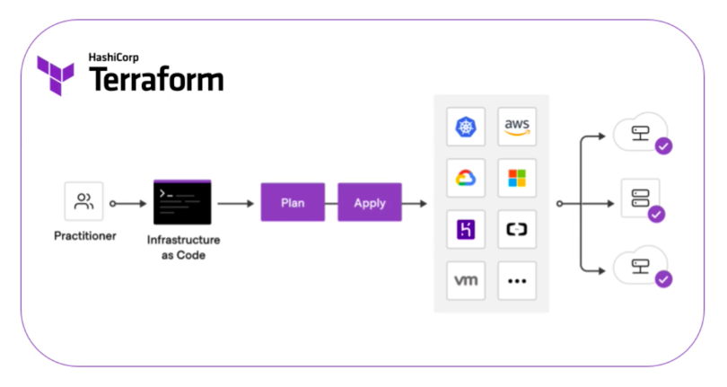

# Objetivo

Utilizar a estrutura declarativa do terraform para orquestrar a criação de um servidor web linux rodando Nginx ou Apache encapsulados em container Docker;

# Caracteriísticas:

Neste laboratório o terraform fica responsável por gerenciar os seguintes itens:

- **Parte 1:** Entender o conceito de orquestração utilizando o terraform com uma construção básica de instâncias;
- **Parte 2:** Avançar dentro da ferramenta criandao uma configuração completa iniando a partir da construção de recursos de rede;
- **Parte 3:** Criação do grupo de segurança e regras de Inbound e Outbound;- 
- **Parte 4:** Criação da instância usando sistema operacional linux e explorando o uso de Cloudinit com deploy de um template responsável por configurar um container Docker com uma App de exemplo;

| Etapa   | Link do lab:                                            |
|---------|---------------------------------------------------------|
| Parte 1 | [https://github.com/FiapDevOps/automation/tree/main/terraform/get-started](https://github.com/FiapDevOps/automation/tree/main/terraform/get-started) |
| Parte 2 | [https://github.com/FiapDevOps/automation/tree/main/terraform/network](https://github.com/FiapDevOps/automation/tree/main/terraform/network) |
| Parte 3 | [https://github.com/FiapDevOps/automation/tree/main/terraform/firewall](https://github.com/FiapDevOps/automation/tree/main/terraform/firewall) |
| Parte 4 | [https://github.com/FiapDevOps/automation/tree/main/terraform/instances](https://github.com/FiapDevOps/automation/tree/main/terraform/instances)|

---

##### Fiap - MBA Cyber Security Forensics, Ethical Hacking & DevSecOps
profhelder.pereira@fiap.com.br

**Free Software, Hell Yeah!**
