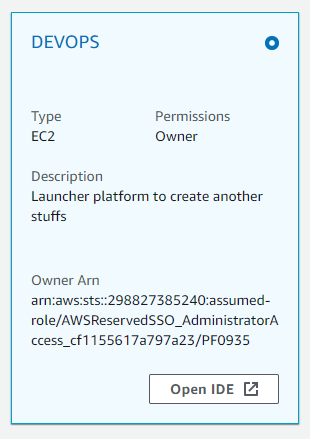

# Objetivo


Utilizar a estrutura declarativa do terraform para orquestrar a criação de um servidor web linux rodando Nginx ou Apache encapsulados em container Docker;

# Caracteriísticas:

Neste laboratório o terraform fica responsável por gerenciar os seguintes itens:

- Entender o conceito de orquestração utilizando o terraform para configuração de rede;
- Criação do grupo de segurança e regras de Inbound e Outbound;- 
- Criação da instância usando sistema operacional linux;
- Deploy de um template responsável por configurar um container Docker com uma App de exemplo;

# Item 1: Configuração de Rede

Para a configuração de rede, utilizaremos o modulo da AWS:
[https://registry.terraform.io/modules/terraform-aws-modules/vpc/aws/latest](https://registry.terraform.io/modules/terraform-aws-modules/vpc/aws/latest);

1.1. Iniciar o ambiente de Desenvolvimento Remoto:

Aceese a console AWS e em seguida selecione o serviço Cloud9, no ambiente **SEGLAB** clique em **OPEN IDE**:



1.2. Utilizando a ferramenta AWS CLI verifique a configuração de rede, subnet e security groups atuais:

```sh
aws ec2 describe-vpcs --query  'Vpcs[].[VpcId, CidrBlock]' --output table
aws ec2 describe-subnets --query  'Subnets[].[VpcId, AvailabilityZone, CidrBlock]' --output table
```

1.3. Acesse o diretório automation/terraform/network e inicialize o serviço:

```sh
cd $HOME/environment/automation/terraform/network
terraform init
```

1.4. Em seguida utilize a instrução plan para verificar a sequência de tarefas que serão executadas pelo terraform:

```sh
terraform plan
```

> Verifique que neste diretório encontram-se as instruções de automação para criação da Virtual Private Network que será usada para hospedar a instância Linux, bem como a configuração dos Grupos de Segurança que serão vinculados a nova instância;

1.5. Após verificar os detalhes do status de execução utilize o terraform para criar os objetos de acordo com o estado esperado:

```sh
terraform apply
```

1.6. As ações que serão executadas durante o processo de automação serão listadas, verifique os items do checklist para entender melhor o que será construido via terraform e em seguida digite "yes" e tecle "Enter" para confirmar a execuçção:

```sh
Do you want to perform these actions?
  Terraform will perform the actions described above.
  Only 'yes' will be accepted to approve.

  Enter a value: yes
```

1.7. Após configurar verifique novamente os recursos de rede disponíveis:

```sh
aws ec2 describe-vpcs --query  'Vpcs[].[VpcId, CidrBlock]' --output table
aws ec2 describe-subnets --query  'Subnets[].[VpcId, AvailabilityZone, CidrBlock]' --output table
```

---

# Item 2: Configuração de Security Group

Para esta etapa serão configurados os [grupos de segurança](https://github.com/fiapsecdevops/automation/tree/main/conceitos/SecurityGroups.md) para entrega das instâncias do projeto via terraform, durante o processo de configuração, utilizaremos o modulo da AWS:
[https://registry.terraform.io/modules/terraform-aws-modules/security-group/aws/latest](https://registry.terraform.io/modules/terraform-aws-modules/security-group/aws/latest);

2.1. Iniciar o ambiente de Desenvolvimento Remoto:

Aceese a console AWS e em seguida selecione o serviço Cloud9, no ambiente **SEGLAB** clique em **OPEN IDE**;

2.2. No repositório do projeto acesse o diretório firewall e inicialize o terraform:

```sh
cd $HOME/environment/automation/terraform/firewall
terraform init
```

2.3. Esta etapa da automação será usada para configurar regras de grupos de segurança fornecendo os seguintes acessos:

| Nome                          | Perfil                                                  |
|-------------------------------|---------------------------------------------------------|
| allow_web_server_access       | Acesso liberado para a porta 80                         |
| allow_access_from_cloud9_sg   | Acesso do grupo do Cloud9 para o VPC main               |
| allow_access_to_mysql_backend | Accesso das VPC publicas para as privadas na porta 3306 |

2.4. Usando o terraform aplique o modelo configurando as regras e grupos:

```sh
terraform apply
```

2.5. Verifique o resultado usando aws cli:

```sh
aws ec2 describe-security-groups  --filters Name=tag:environment,Values=lab --output json
```

---

# Item 3: Configuração de Aplicações

Na terceira e última etapa utilizaremos a arquitetura anterior para a entrega de uma aplicação de exemplo;

3.1. Inicialize o terraform no diretório contendo a automação das instancias:

```sh
cd $HOME/environment/automation/terraform/instances
terraform init
```

3.2. Verifique o planejamento das alterações, em resumo a automação deverá recuperar alguns dados sobre a VPC e Subnets para em seguida entrega duas instancias EC2 com um bloco de configuração [usando cloud-init](https://cloudinit.readthedocs.io/en/latest/) para instalar pacotes e subir a aplicação;

3.3. Finalmente execute a ultima etapa configurando a aplicação:

```sh
terraform apply
```

3.4. Ao final do processo liste as instancias criadas

```sh
aws ec2 describe-instances  --filters Name=tag:environment,Values=lab --output json
```

3.5. Com ajuda do [cloud-init](https://cloud-init.io/) entregue no diretório templates as instancias foram lançadas com um setup inicial de uma aplicação web, consulte o endereço ip publico e tente o acesso pelo navegador:

```sh
aws ec2 describe-instances  --filters Name=tag:environment,Values=lab \
    --query "Reservations[*].Instances[*].PublicIpAddress" \
    --output text 
```

3.6. Para finalizar nosso exemplo utilizaremos o terraform para destruir o setup criado, isso é possível pois como solução de provisionamento o terraform guarda o [estado dos recursos gerenciados](https://www.terraform.io/language/state), essa informação deve preferencialmente ser amaenada em um bucket ou similar pois é utilizada para recuperar o estado atual dos objetos para manipulaçãoou remoção:

```sh
terraform state list
```

3.7. Faça a remoção dos recursos e repita o mesmo processo em sequencia nos diretórios firewall e por fim network:

```sh
terraform destroy
```

---

##### Fiap - MBA Cyber Security Forensics, Ethical Hacking & DevSecOps
profhelder.pereira@fiap.com.br

**Free Software, Hell Yeah!**
