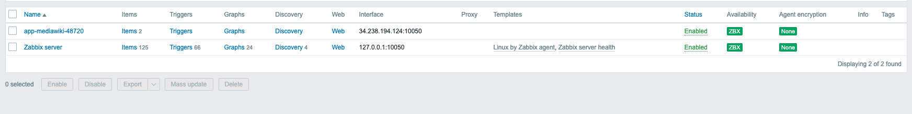
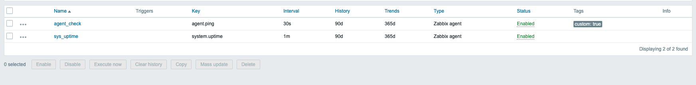
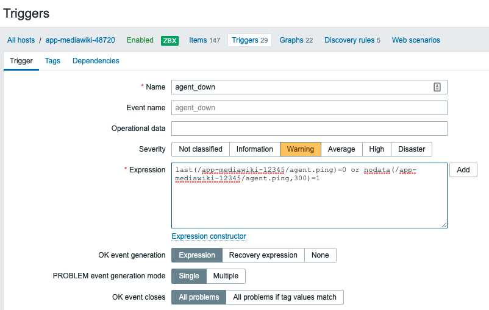
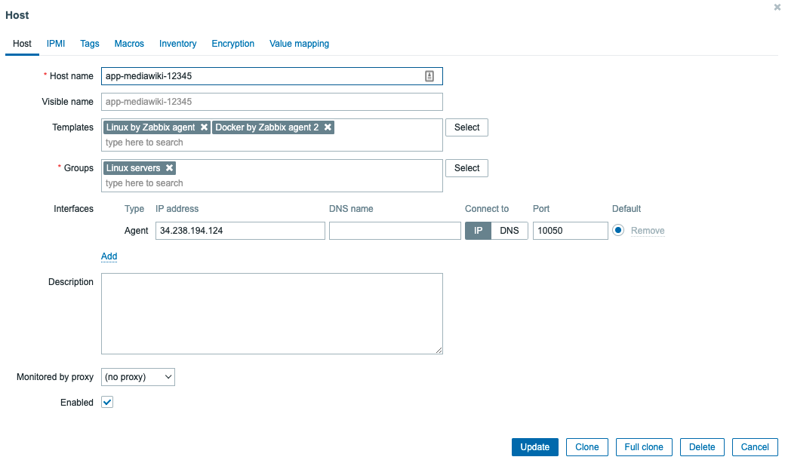

# Objetivo


Apresentar um cenário com o Zabbix como solução de monitoração centralizada para uma arquitetura simples com uma aplicação simples em Docker;

# Caracteriísticas:

Neste laboratório o zabbix será apresentado no seguinte padrão

- Utilizaremos uma infraestrutura centralizada para facilitar a administração, o ambiente será disponibilizado na URL http://zabbix.fiaplabs.com/ as credenciais de acesso serão fornecidas durante o laboratório;
- Criaremos uma configuração explorando templates para monitoração do Sistema Operacional dos servidores com a aplicação docker;


# Item 1: Instalação do Zabbix

Neste laboratório o ambiente já foi configurado usando a versão 6 do Zabbix com base no processo de instalação descrito nos endereços abaixo:

- [Documentação oficial de instalação do Postgres](https://www.postgresql.org/download/linux/ubuntu/)
- [Documentação oficial de instalação do Zabbix](https://www.zabbix.com/download?zabbix=5.4&os_distribution=ubuntu&os_version=20.04_focal&db=postgresql&ws=nginx)
- [Configurando um cenário com autoregistration](https://www.zabbix.com/documentation/2.0/en/manual/discovery/auto_registration)
- [Integração com o Telegram](https://www.zabbix.com/integrations/telegram)

# Item 2: Conceitos Básicos

## Hosts
Diferente do modelo de timeseries testado no cenário com o prometheus, no zabbix os endpoits de monitoração são identificados como hosts, o conceito é similar com a diferença prática de que neste formato toda a monitoração é estruturada com base em configurações sobre estes endpoints de fornecimento de dados;

Os hosts são organizados com base em grupos identificados como **Hosts Groups**

## Items
Após a configuração de um host é necessário definir quais as métricas a serem coletadas, essa definição é chamada **Item**, esses items são configurados com base em **Keys** aqui temos um paralelo direto ao timeseries, uma Key é essencialmente uma expressão lógica com uma informação a ser coletada, como consumo de CPU ou uso total de disco, por exemplo;

## Triggers
As triggers também são identificadas como problem expression e basicamente seguem o mesmo conceito em qualquer plataforma de monitoração, elas definem qual a consulta e resposta (trigger expression) que identificam um problema e sua respectiva severidade;

## Actions
As Actions são efetivamente o processo de alerta e de tarefas executadas a partir do disparado de triggers com base em condições e operações ou ações que devem ser executadas, uma action pode ser usada para alertar um plantonista com base no envio de e-mail ou Post em uma plataforma como o Telegram ou Slack.

# Item 3: Configuração prática de um host

3.0 Para criar a aplicação de teste utilize o terraform aplicando a configuração do diretório monitored_app:

```sh
cd ~/environment/automation
git pull
cd zabbix/monitored_app
rm -rf .terraform
terraform init
terraform apply 
```

3.1 Acesse o Zabbix configurado previamente para a aula na URL: [http://zabbix.fiaplabs.com](http://zabbix.fiaplabs.com), no painel de administração do Zabbix acesse o menu no canto direito da tela, escolha as opções:

3.2 Configuration -> Hosts -> Create Hosts (Utilize o botão no canto superior direito)

3.3 Configure o Host adicionando os parâmetros abaixo (Mantenha em branco os campos não selecionados)

| Campo | Valor |
|-------|-------|
| Host name  | app-mediawiki-12345 (Utilize o seu rm apenas números como identificador no lugar de 12345) |
| Groups:    | Linux Servers |
| Interfaces | Agent (Clique no botão **Add** e selecione a opção **Agent**, especifique o endereço IP público da instância gerada via terraform) |

3.4 Mantenha os outros campos com o valor atual e ao final do processo clique no botão **Add**

# Item 4: Configuração prática de um item de monitoração

3.1 Ao final da etapa anterior o host terá sido adicionado conforme o exemplo abaixo;



Prosseguiremos deste ponto configurando um novo Item de monitoração;

3.2 Para criar um Item de monitoração clique sobre o nome Items ao lado do nome do Host recém-criado (Segunda coluna com base na imagem acima);

3.3 No menu seguinte clique no botão "create Item" localizado no canto superior direito da tela;

3.4 Nesta etapa preencha os campos conforme os valores listados abaixo:

| Campo | Valor |
|-------|-------|
| Name | sys_uptime |
| Key | system.uptime  # Selecione esta opção no menu de Select |
| Unit | s |
| Update internval | 1m |

3.5 Crie um segundo Item com base nas informações abaixo:

| Campo | Valor |
|-------|-------|
| Name | agent_check |
| Key | agent.ping  # Selecione esta opção no menu de Select |
| Update internval | 30s |

Ao final do processo a interface exibira dois items configurados conforme a imagem abaixo;



# Item 5: Configurando triggers para problemas

5.1 Para criar uma trigger volte ao menu  Configuration -> Hosts e na linha relativa ao nosso host recém-configurado clique sobre o nome Triggers (Terceira coluna com base na imagem acima);

5.2 No menu seguinte clique no botão "create Trigger" localizado no canto superior direito da tela, preencha os campos conforme a imagem abaixo:



| Campo | Valor |
|-------|-------|
| Name | agent_down |
| Severity | Warning |
| Expression | last(/app-mediawiki-12345/agent.ping)=0 or nodata(/app-mediawiki-12345/agent.ping,300)=1 |

**Substitua o nome do host de acordo com o host configurado no seu teste**

Se precisar copie e coloque a expressão diretamente no campo Expression:

```sh
last(/app-mediawiki-12345/agent.ping)=0 or nodata(/app-mediawiki-12345/agent.ping,300)=1
```

5.3 Ao final do processo clique no botão **Add**

> É possível disparar o gatilho dessa expressão apenas desligando o agent, para isso a partir da instância da aplicação pare o serviço usando systemctl com o comando:

```sh
sudo systemctl stop zabbix-agent2
```

> Depois de alguns minutos acesse no menu no canto direito da tela a opção Monitoring -> Problems;

# Item 6: Trabalhando com templates

Na lógica de monitoração via zabbix o processo de criação manual de items pode ser substituído pela [https://www.zabbix.com/documentation/current/en/manual/config/templates](aplicação de templates), um template é uma relação de entidades que pode entregar um modelo pronto para Items, Triggers, dashboards, etc.

6.1 Em nosso cenário iremos adicionar dois templates ao host configurado recentemente, para isso a partir do menu principal acesse Configuration -> Hosts -> Clique sobre o nome do host criado recentemente;

6.2 No menu seguinte na caixa templates digite e em seguida selecione:

 - Linux by Zabbix agent
 - Docker by Zabbix agent 2

O primeiro template será utilizado para obter métricas e triggers customizadas com base em sistemas operacionais linux enquanto o segundo template será utilizado para obter métricas da nossa aplicação de teste configurada usando [docker](https://www.zabbix.com/integrations/docker);

Ao final do processo teremos um layout similar ao do exemplo abaixo:



6.3 Clique no botão "Update"para atualizar a configuração;

Após este processo verifique novamente e explore a relação de triggers e items do Host

6.4 Para verificar os novos dados coletados no menu no canto direito da tela selecione "Monitoring" -> "Latest data"

---

# Item 6: Configurando uma Action

6.1 Acesse o menu a esquerda da tela e escolha a opção Configuration -> Actions -> Trigger Actions;

6.2 Verifique os detalhes da configuração de envio de alertas no item "Report to telegram", esse setup foi configurado conforme a documentação [Integração com o Telegram](https://www.zabbix.com/integrations/telegram);

---

##### Fiap - MBA DEVOPS Engineering
profhelder.pereira@fiap.com.br

**Free Software, Hell Yeah!**
